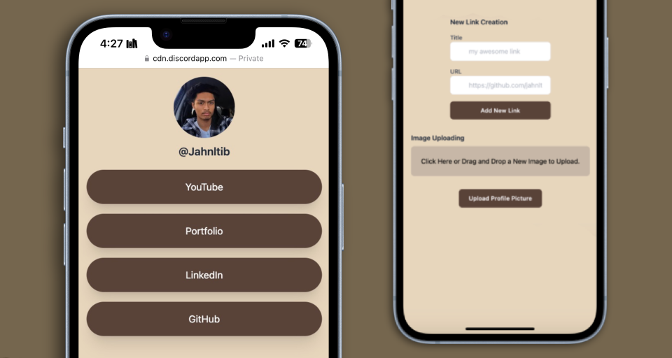
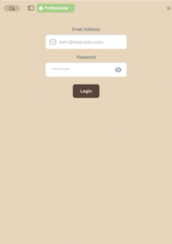

# linktree-clone 

Linktree clone with user account system and authentication to display social links using React with NextJS, TailwindCSS, & Supabase.



## Demo 


## Features 
- Sign up & User Account System For Individualized Pages.
- Email Verification.
- Functional Links.
- Profile Picture.
- 'Log Out' Button to test public view.
- Theme Configuration

## About 

I implemented this project in order to:
- Utilize and gain experience with Supabase
- Create a project using Next.JS and tailwind
- Implement user-authentication via Supabase 
- Implement image uploading via the [`react-images-uploading`](https://www.npmjs.com/package/react-images-uploading) package.

## Installation 

1. Install [`Tailwind CSS with Next.js`](https://tailwindcss.com/docs/guides/nextjs).

2. Create an account on [`Supabase`](https://supabase.com) and create a project.

3. In `.env.local`, set 'NEXT_PUBLIC_SUPABASE_URL' (project-settings>api>project-url) and 'NEXT_PUBLIC_SUPABASE_ANON_KEY' (project-settings>api>project-api-keys) with the corresponding values from your Supabase.

4. Run and install the Supabase JavaScript library:
```bash
npm install @supabase/supabase-js
```

5. Run and install the react package for uploading images: 
```bash
npm install @supabase/supabase-js
```

6. Create a new table in [`Supabase`](https://supabase.com).
- Set the name as links.
- Create a column called 'title', type varchar.
- Create a column called 'url', type varchar.
- Create a column called 'user_id', type varchar.
- Disable RLS (for testing purposes).

7. Create an additional new table .
- Set the name as users
- Create a column called 'profile_picture_url', type varchar.
- Create a column called 'username', type varchar.
- Disable RLS (for testing purposes).

8. Create a bucket called 'public1' in storage.

9. Create a new policy for the bucket under 'Other policies under storage.objects'.
- Name it 'All access for all users'.
- Under 'Allowed operation', select ALL.
- Under USING and WITH CHECK expression, type 'true' for both.

10. In the file `your-component.js` find the following line:
```Bash
router.push("/jahnltib");
```
Replace with the username you sign up with.


## Getting Started 

1. First, run the development server:

```bash
npm run dev
# or
yarn dev
# or
pnpm dev
# or
bun dev
```

2. Open [http://localhost:3000](http://localhost:3000) with your browser to test a live demo.

3. Sign up and check email for verification.

4. Log in, add links, and upload profile picture.

5. Log out to show public page.

## Contributing 

This project is not currently open for contributions.

## License 

This project is licensed under the terms of the GNU General Public License v3.0.
